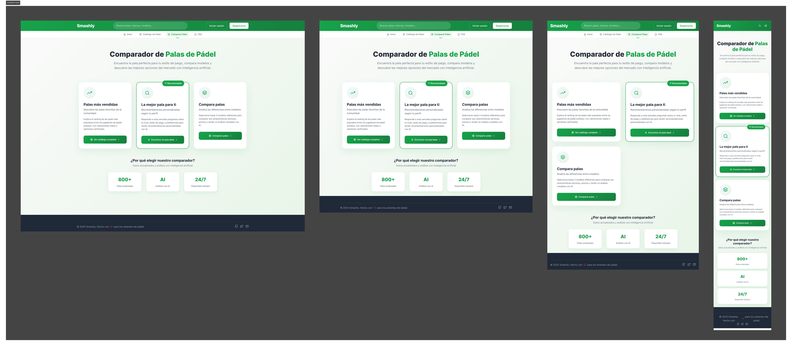
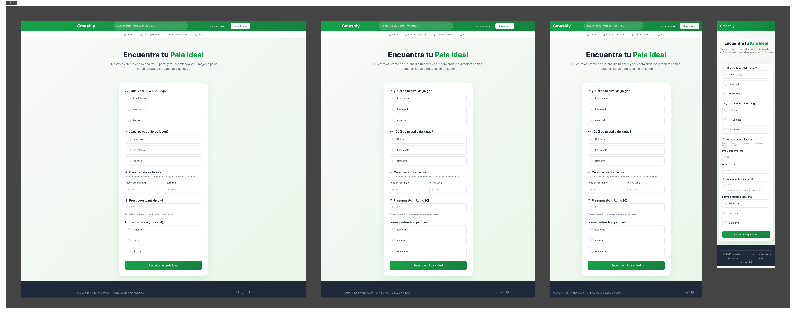
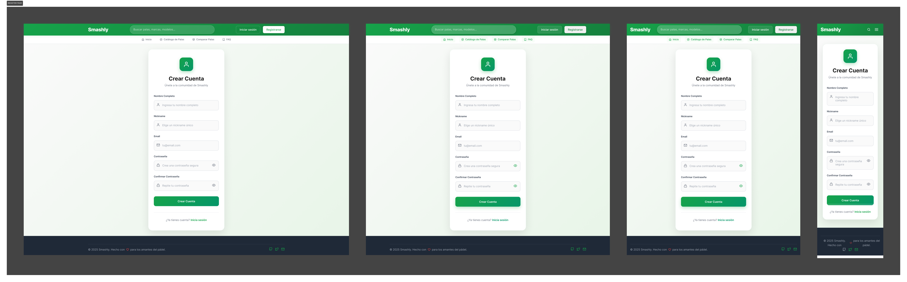
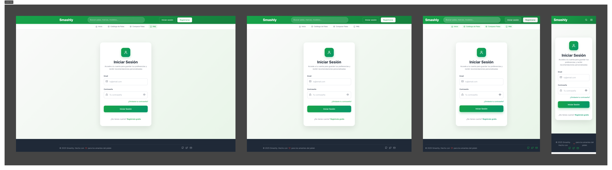
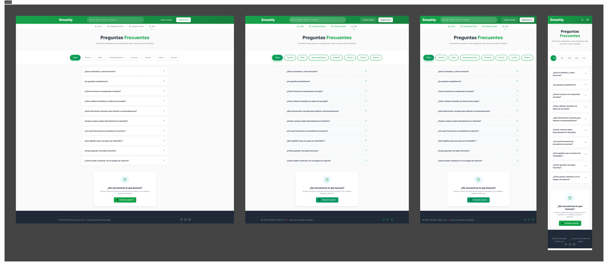

  

---

## 🏐 ¿Qué es Smashly?

**Smashly** es una aplicación web diseñada para jugadores de pádel amateur y semi-profesionales que quieren encontrar la pala perfecta para su estilo de juego.

Nuestra herramienta te permite:
- **Explorar** un catálogo completo de palas con todas sus características técnicas
- **Comparar** varias palas lado a lado para ver diferencias en peso, balance, forma y más
- **Recibir recomendaciones** personalizadas basándote en tu nivel, estilo de juego y preferencias
- **Guardar favoritos** para crear tu lista de palas favoritas
- **Leer y escribir reseñas** de otros jugadores como tú

---

## 🌐 Versión Online

La aplicación está desplegada y lista para usar:

**👉 [smashly-app.es](https://smashly-app.es)**

---

## 🎥 Demo

Conoce Smashly en acción:

**👉 [Ver demo](https://drive.google.com/file/d/13p10A2KiYgeTcCunGJ9ARxZITATbKbcN/view?usp=sharing)**

---

## 📑 Índice

1. [Objetivos del Proyecto](./docs/objectives.md)
2. [Metodología](./docs/methodology.md)
3. [Análisis Inicial](./docs/analysis.md)
4. [Funcionalidades v0.1](./docs/functionalities-v0.1.md)
5. [Funcionalidades v1.0](./docs/functionalities-v1.0.md)
6. [Funcionalidades Completas](./docs/functionalities.md)
7. [Guía de Desarrollo](./docs/development-guide.md)
8. [Planificación](./docs/planification.md)
9. [Seguimiento](./docs/following.md)
10. [Autores](./docs/authors.md)
11. [API Documentation](./docs/api-docs.yaml)

---

## ✨ Características

- **Catálogo de palas** — Explora todas las palas del mercado con detalles técnicos completos
- **Búsqueda y filtros** — Encuentra la pala ideal por marca, forma, balance y precio
- **Comparador** — Compara varias palas simultáneamente
- **Recomendador** — Obtén sugerencias personalizadas según tu perfil
- **Favoritos** — Guarda las palas que más te gusten
- **Reseñas** — Lee opiniones de otros jugadores y comparte las tuyas
- **Panel de administración** — Gestión completa para administradores

---

## 📸 Capturas de Pantalla

<b>Ver galería</b>

#### Página Principal

#### Catálogo de Palas

#### Detalle de Pala

#### Comparador

#### Formulario de Recomendación

#### Registro y Login

#### Sección FAQ

---

## 👥 Créditos

**Smashly © 2025** — Trabajo de Fin de Grado  
Ingeniería del Software — Universidad Rey Juan Carlos

---

## 📄 Licencia

Licensed under the Apache License, Version 2.0 (the "License");
you may not use this file except in compliance with the License.
You may obtain a copy of the License at

    http://www.apache.org/licenses/LICENSE-2.0

Unless required by applicable law or agreed to in writing, software
distributed under the License is distributed on an "AS IS" BASIS,
WITHOUT WARRANTIES OR CONDITIONS OF ANY KIND, either express or implied.
See the License for the specific language governing permissions and
limitations under the License.