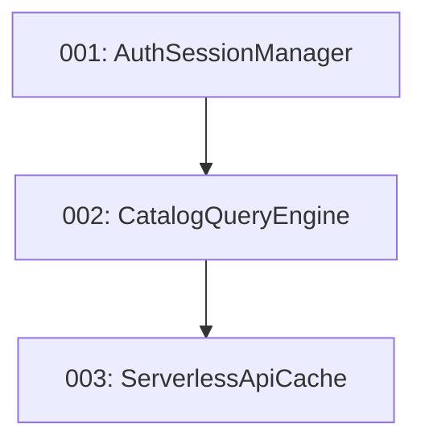

# Smashly App — Plan de Mejora de Arquitectura y Rendimiento (10/10 Readiness)

Este directorio contiene los planes de ejecución detallados y auto-contenidos para optimizar la arquitectura, resiliencia y velocidad de **Smashly App**.

## Resumen de Planes

| # | Plan | Categoría | Impacto | Esfuerzo | Riesgo | Estado |
|---|---|---|---|---|---|---|
| 001 | [001-auth-session-manager.md](./001-auth-session-manager.md) | Auth & Resiliencia | HIGH | M | LOW | READY |
| 002 | [002-catalog-query-engine.md](./002-catalog-query-engine.md) | Frontend & Perf | HIGH | M | LOW | READY |
| 003 | [003-serverless-api-cache.md](./003-serverless-api-cache.md) | Backend & BD | MEDIUM | S | LOW | READY |

## Orden de Ejecución Recomendado

1. **001-auth-session-manager**: Consolida la gestión de sesión, refresco de JWT y resolución de roles sin carreras ni bloqueos.
2. **002-catalog-query-engine**: Desacopla la lógica de filtrado y búsqueda del catálogo en un hook puro con debouncing a 60fps.
3. **003-serverless-api-cache**: Implementa cabeceras `Cache-Control` y proyecciones SQL ligeras en handlers serverless.
